# SPOKE Visualizer Tutorial

**Author: Andreas Bueckle**

**Started: 10/12/21 (updated: 8/18/22)**

---

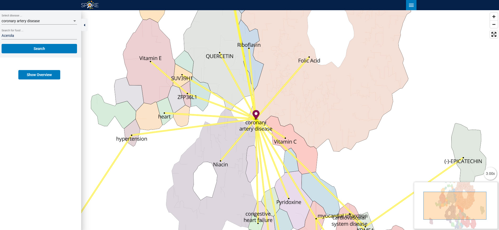

**Note that this tutorial is also available as a video:** 
[Video tutorial](https://iu.mediaspace.kaltura.com/media/t/1_beocenb3)

Welcome to the SPOKE Visualizer! In this tutorial, we are going to explain what the SPOKE Visualizer is and how to use it. Feel free to follow along as we explore how to visualize certain subsets of the underlying SPOKE data to uncover relationship between food and diseases. Specifically, the SPOKE Visualizer shows connections between foods and diseases via compounds in that food. This means that the SPOKE Visualizer looks at foods that can support health as well as foods that are detrimental to health. 

In this documentation, we will learn how to explore the connections between foods and diseases using the SPOKE Visualizer as well as how to retrieve information from it. Let’s have a look at this ourselves.  

When you enter the website(see link in your survey), you are greeted by a landing page with some information about the size and goal of SPOKE. Click the blue button labeled **Spoke Visualizer** at the bottom to get to the visualization proper. 

The next page shows the **overview**. On the right side, you see a network visualization (pink). On the left side (blue), you see two dropdown menus that allow you to customize what you see in the visualization on the right. 

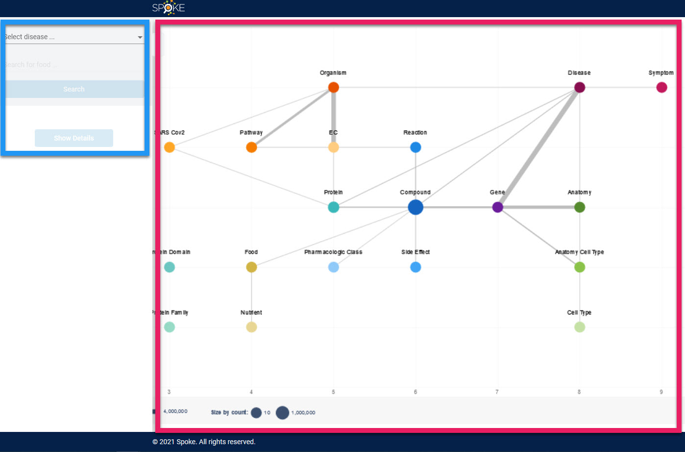

Now, let’s select a **disease** and a **food** between which we would like to explore connections. From the dropdown menu on the top-left, let’s select *coronary artery disease*. Then, from the other dropdown menu, let’s select *Almond*. Then, let’s click **Search**. 

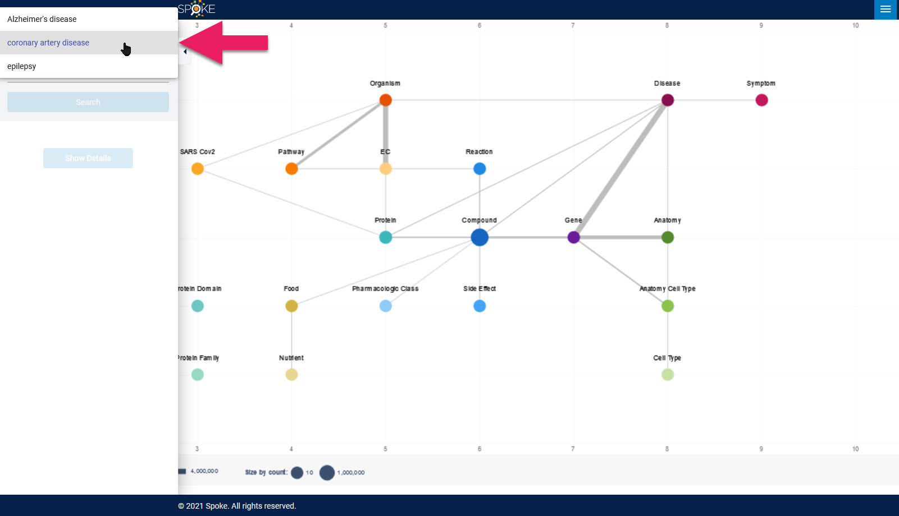

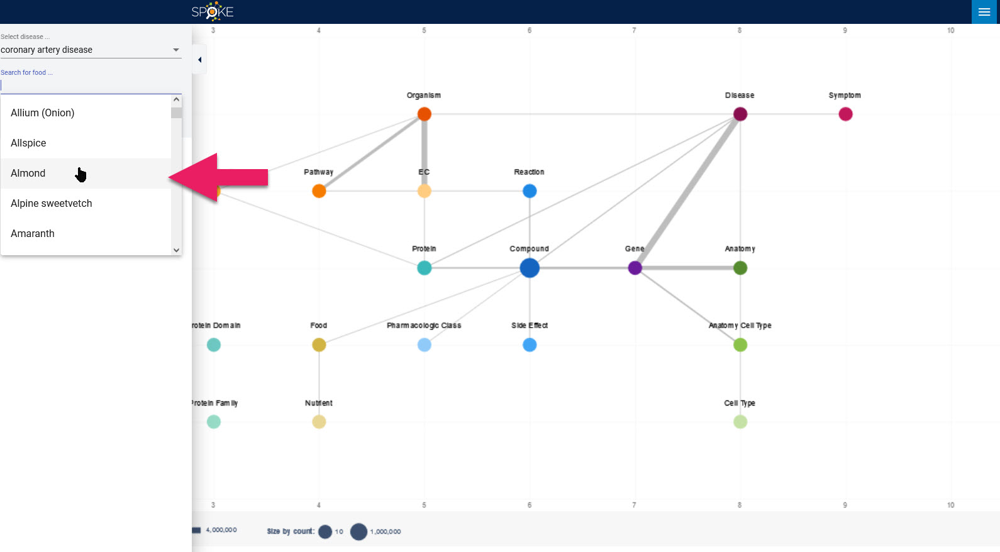

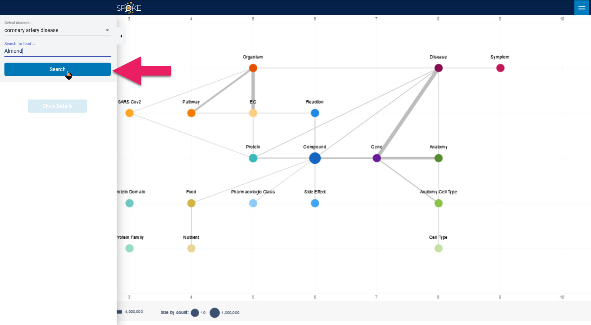

Then, the visualization on the right changes. Food, Compound, and Disease are now in normal colors while everything else is in the background. 

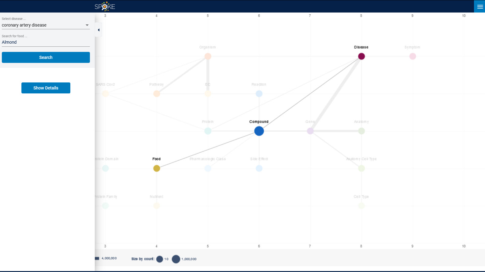

Now, if you move your cursor over the edge between Food and Compound of Disease, you can learn more about the nature of this connection. For example, we learn that the **target** (*Almond*) has a relationship of type **“contains”** with the **source** (*Folic Acid*), meaning simply that almond contains folic acid. 

Likewise, when we move our cursor over the edge between Compound and Disease, we see that the **target** (*Folic Acid*) has a relationship of type **“treats”** with the **source** (*coronary artery disease*), which means that Folic Acid has a beneficial influence on patients with coronary artery disease. 

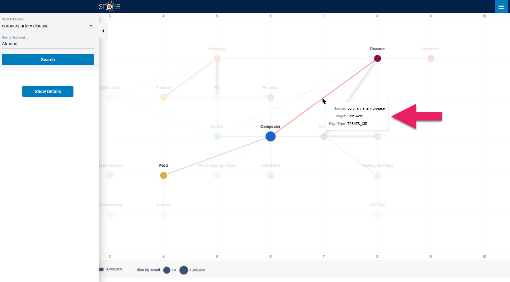

So it is good to know on a surface level, but would it not be interesting to see these relationships visualized in a way that is more familiar to many of us, like, say a map? Let’s do that! Click the blue Show Details button on the left, and the visualization on the right side changes into a map. 

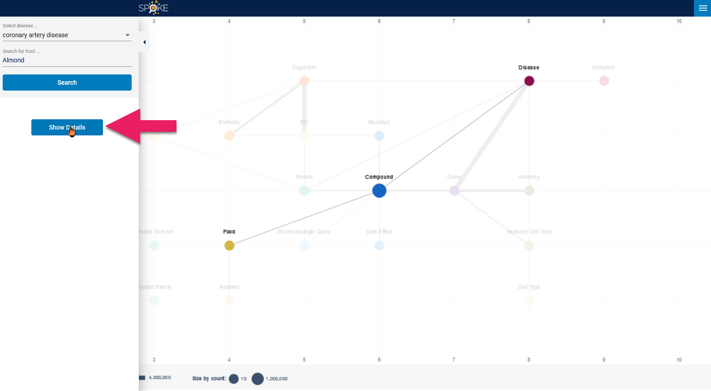

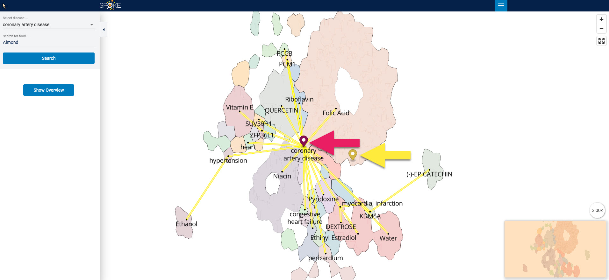

If you have ever used Google Maps or a similar application, this will be familiar. The purple marker (with the pink arrow) highlights our selected disease: *coronary artery disease*; the yellow marker (with the yellow arrow) highlights our selected food: *almonds*. The yellow lines show all the compounds that are connected to *coronary artery disease*. Let’s now navigate through this map to uncover more insights. 

Use your mouse scroll wheel to zoom into the map. Let’s go to the yellow marker. We then see more yellow lines appear, going from other foods (little black dots) to the *Folic Acid* compound (blue arrow). 

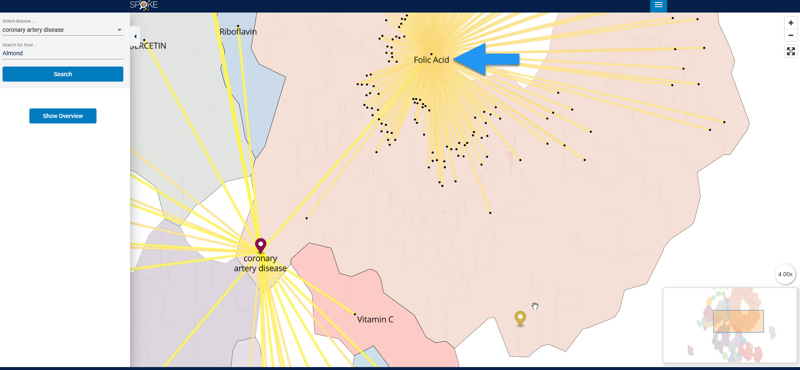

Press and hold the left mouse button to pan along the map. You can then see all the different foods that contain *folic acid* (blue arrow), like *acorn* and *buttermilk*. Panning over to  *folic acid* shows us just how many foods in the SPOKE graph contain *folic acid*. Among the many foods, we still see *almonds* (yellow arrow). You can also press and hold the right mouse button to change the angle of your view to assume a more ground-level perspective.

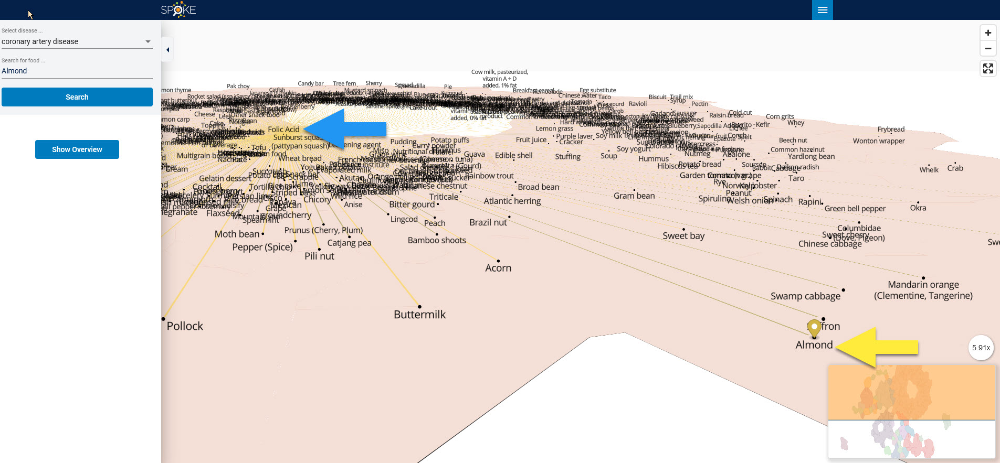

In the bottom-right corner, we have what is called a mini-map. This shows an overview of the entire map, with a rectangle showing your viewport, that is what you currently see in the big view of the map. 

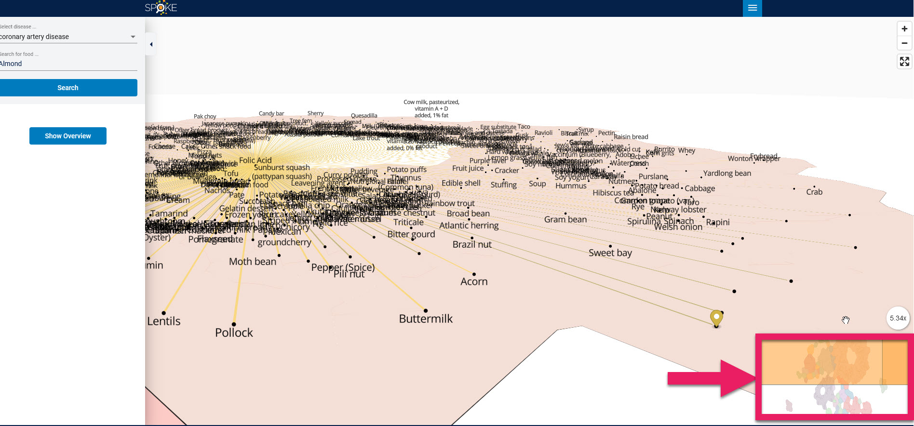

Now, if we want to explore a new connection, we can go back to the overview by clicking the Show Overview button. 

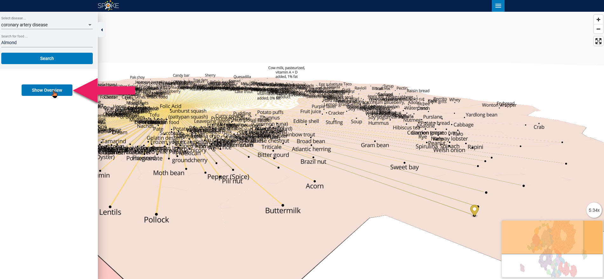

We can then simply select new entries in the two dropdown menus on the left. Let’s go with *epilepsy* and *arepa*. 

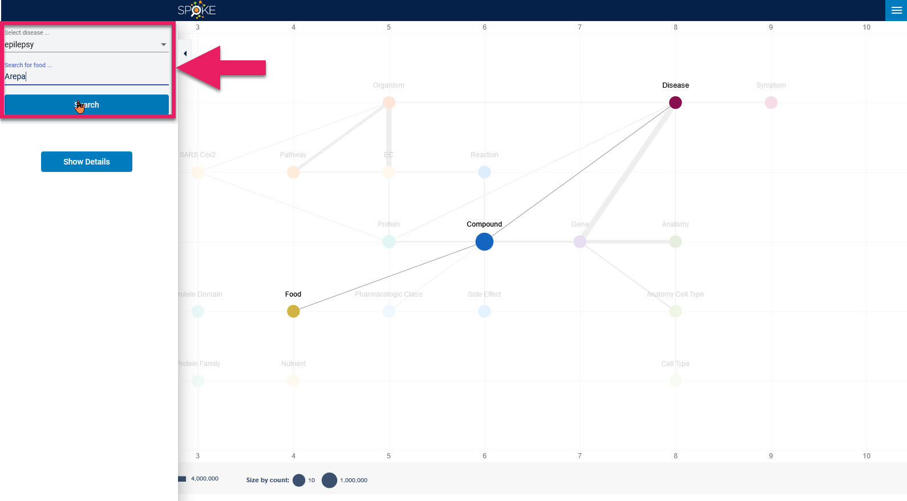

According to the overview, the connecting compound is Pyridoxine. 

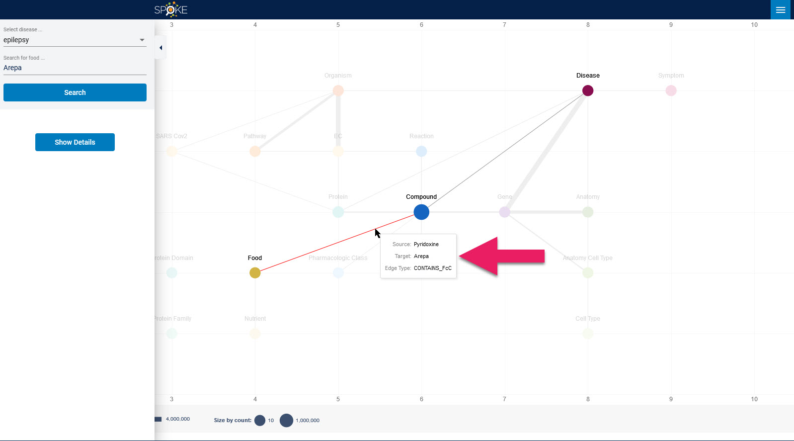

Let’s click Show Details to get back to the map, and then we see new markers for epilespy in purple and Pyridoxine in yellow. 

**NOTE:** When you are in the Show Details view, and you would like to choose a new food and/or disease, you will first have to click the Search button, then go backt to the Overview, then back to the Show Details view in order to see an updated map with markers for food and disease.

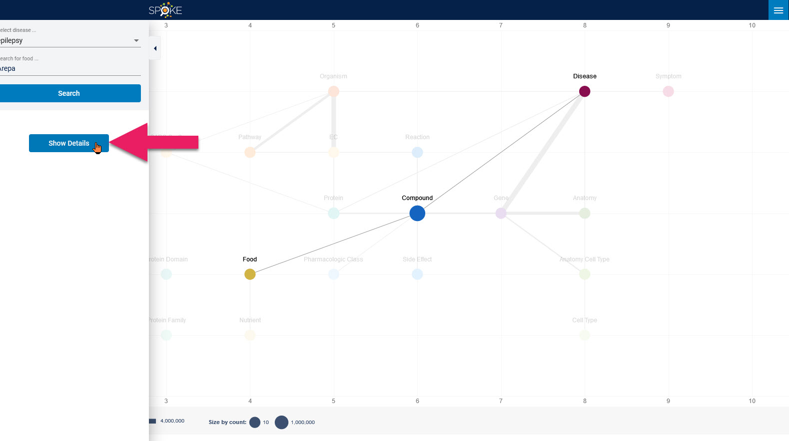

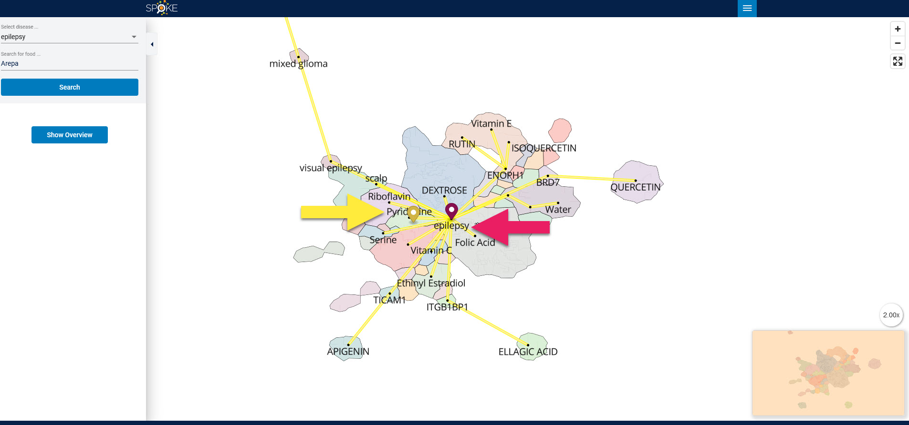

In this tutorial, we discussed how to select a food and a disease, read the overview visualization, and then navigate the details visualization. Please take some time to explore the SPOKE Visualizer on your own before continuing with the study. Maybe try a few more combinations of **food** and **disease**, maybe with your favorite food? 

